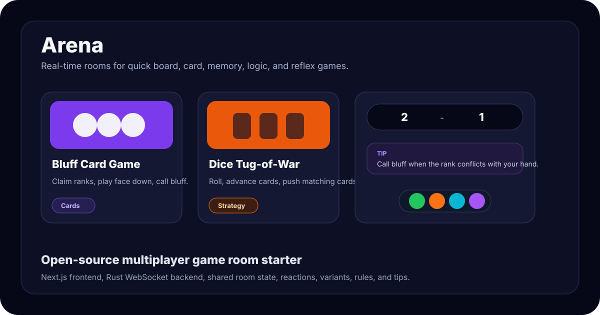

# Arena

Arena is an open-source real-time multiplayer game room project. It pairs a Next.js frontend with a Rust WebSocket backend so two players can create a room, share a code, switch variants, react with emoji, reconnect after a drop, and play quick browser-friendly games.



## Why This Project Exists

Most casual game portals are fast to browse: category filters, visual cards, clear play buttons, and low-friction starts. Arena takes that browsing rhythm and focuses it into private multiplayer rooms that are easy to host, extend, and self-deploy.

The current game catalog includes board, card, logic, memory, dice, and reflex games, with reusable UI for rules, tips, scorebars, room lifecycle, and variants.

## Features

- Real-time two-player rooms over WebSockets
- Create room, join by code, leave room, reconnect, and opponent-disconnect banner
- Shared score tracking across rounds
- Same-room variant switching for supported game families
- Collapsible rules panels with rotating tips
- Draggable and hideable emoji reaction dock
- Home page game catalog with filters, gameplay previews, and variant counts
- Backend-authoritative rules for every game
- Private per-player state for hidden-information games such as Code Breaker and Bluff
- Focused tests for game engines, websocket protocol, and frontend room behavior

## Games

| Game | Type | Notes |
| --- | --- | --- |
| Tic-Tac-Toe Variants | Strategy | Classic, Disappearing, Joker, Gobblet, Gravity, Bidding, and Blind Memory |
| Dice Tug-of-War | Dice strategy | Roll, advance your cards, and automatically push matching opponent cards back |
| Code Breaker | Logic | Crack a hidden 4-digit code using positional clues |
| Number Range | Logic | Higher/lower range guessing as a Code Breaker variant route |
| Sequence Memory Flip | Memory | Flip cards in order and punish wrong guesses |
| Higher or Lower | Quick logic | Sprint, Classic, and Expert number ranges |
| Stop Clock | Reflex | Stop as close to 20.00 seconds as possible |
| Bluff Card Game | Cards | Play face down, claim ranks, and call bluff |

## Architecture


```text
frontend/                 Next.js app router UI
  src/app/                Routes for home and game pages
  src/components/         Lobby, GameFrame, reactions, banners, shared UI
  src/context/            WebSocket room/session state
  src/lib/gameMetadata.ts Game catalog, rules, tips, variants, previews

backend/                  Rust Axum websocket server
  src/lobby.rs            Rooms, players, routing, scoring, reconnect flow
  src/protocol.rs         Client/server websocket message types
  src/games/              Authoritative game engines
```

## Tech Stack

- Frontend: Next.js, React, TypeScript, CSS Modules, Vitest
- Backend: Rust, Axum, Tokio, Serde, Rand
- Transport: WebSocket JSON messages
- Deployment target used by this repo: Google App Engine / App Engine Flex

## Getting Started

### Prerequisites

- Node.js 20 or newer
- npm
- Rust stable toolchain
- Google Cloud CLI only if you want to deploy

### 1. Clone

```bash
git clone https://github.com/shivam411/online-multi-games.git
cd online-multi-games
```

### 2. Run The Backend

```bash
cd backend
cargo run
```

By default the backend serves WebSockets at:

```text
ws://localhost:6100/ws
```

### 3. Run The Frontend

Open a second terminal:

```bash
cd frontend
npm install
npm run dev
```

Open:

```text
http://localhost:3201
```

If your backend runs somewhere else, set the frontend websocket URL:

```bash
NEXT_PUBLIC_WS_URL=ws://localhost:6100/ws npm run dev
```

On Windows PowerShell:

```powershell
$env:NEXT_PUBLIC_WS_URL="ws://localhost:6100/ws"
npm run dev
```

## Useful Commands

### Backend

```bash
cd backend
cargo test
cargo run
```

### Frontend

```bash
cd frontend
npm run build
npm test -- --run
npm run test:coverage
```

## Adding A New Game

1. Add a Rust engine in `backend/src/games/`.
2. Register the module in `backend/src/games/mod.rs`.
3. Add a `GameInstance` variant and `create_game` branch in `backend/src/lobby.rs`.
4. Add a `GameAction` payload in `backend/src/protocol.rs`.
5. Implement `process_action` and `check_game_over` behavior.
6. Add a page under `frontend/src/app/games/<game-name>/`.
7. Wrap the page with `Lobby` and use `GameFrame` for score/rules layout.
8. Add metadata to `frontend/src/lib/gameMetadata.ts` so the home catalog, waiting room, and rules panel all stay in sync.
9. Add focused backend and frontend tests for the game behavior.

For hidden-information games, send per-player state from the backend. Code Breaker and Bluff Card Game are good examples.

## UI Principles

- The first screen should be playable, not a marketing page.
- Game cards should communicate gameplay quickly through previews, categories, and variants.
- Rules should be available but not noisy during active play.
- Waiting rooms should teach the game while a player waits.
- The backend should remain authoritative for game rules and win state.
- Hidden information must never be sent to the wrong player.

## Deployment Notes

The project has been deployed with Google App Engine / App Engine Flex. Typical deployment flow:

```bash
cd backend
gcloud app deploy app.yaml

cd ../frontend
gcloud app deploy app.yaml
```

If an App Engine deploy is interrupted, confirm the operation completed and then route traffic to the new version:

```bash
gcloud app operations wait OPERATION_ID
gcloud app services set-traffic SERVICE_NAME --splits VERSION_ID=1
```

Deployment configuration can vary by project, so check `backend/app.yaml`, `frontend/app.yaml`, and `.gcloudignore` before deploying.

## Contributing

Contributions are welcome. Please read [CONTRIBUTING.md](CONTRIBUTING.md) before opening a pull request.
Participation is covered by the [Code of Conduct](CODE_OF_CONDUCT.md).

Good first contributions include:

- New game variants
- Better game metadata, tips, and preview steps
- Accessibility improvements
- Focused tests for game engines
- Mobile layout polish
- Documentation screenshots and examples

## Security

Please do not open public issues for sensitive vulnerabilities. See [SECURITY.md](SECURITY.md).

## License

MIT. See [LICENSE](LICENSE).
