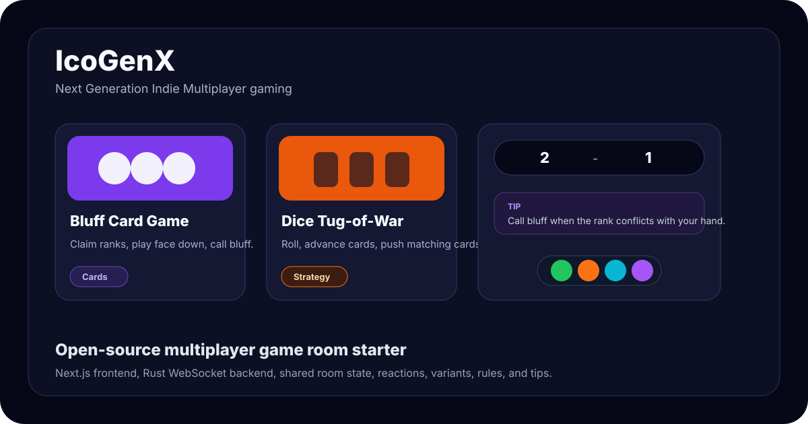
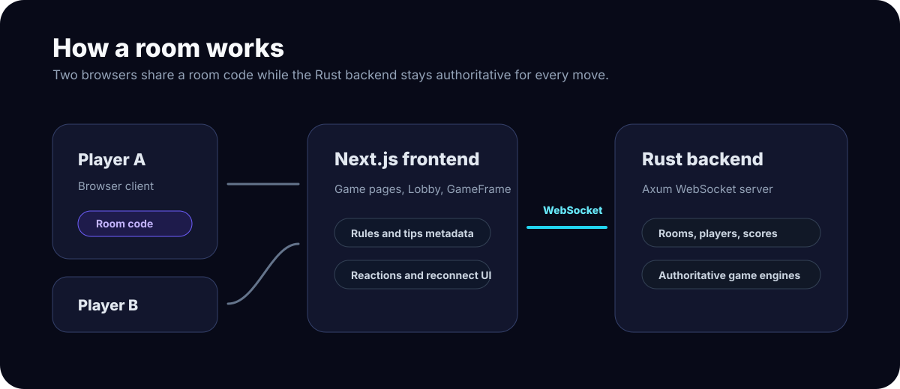

# IcoGenX.com

Next Generation Indie Multiplayer gaming.

IcoGenX is an open-source real-time multiplayer game room project. It pairs a Next.js frontend with a Rust WebSocket backend so two players can create a room, share a code, switch variants, react with emoji, reconnect after a drop, and play quick browser-friendly games.



## Why This Project Exists

Most casual game portals are fast to browse: category filters, visual cards, clear play buttons, and low-friction starts. IcoGenX takes that browsing rhythm and focuses it into private multiplayer rooms that are easy to host, extend, and self-deploy.

The current game catalog includes board, card, logic, memory, dice, and reflex games, with reusable UI for rules, tips, scorebars, room lifecycle, and variants.

## v2.0.0 Platform Plan

The current v2.0.0 roadmap is tracked in [docs/v2.0.0-platform-plan.md](docs/v2.0.0-platform-plan.md). It covers the verified repo status, friends/presence hardening, quality gates, Twist Checkers, and Drop Four Chaos.

## Features

- Real-time two-player rooms over WebSockets
- Create room, join by code, leave room, reconnect, and opponent-disconnect banner
- Shared score tracking across rounds
- Same-room variant switching for supported game families
- Collapsible rules panels with rotating tips
- Draggable and hideable emoji reaction dock
- Home page game catalog with filters, gameplay previews, and variant counts
- Backend-authoritative rules for every game
- Private per-player state for hidden-information games such as Code Breaker and Bluff
- Focused tests for game engines, websocket protocol, and frontend room behavior

## Games

Each game is two-player, real-time, and authoritative on the backend. Variants share the room and can be switched mid-lobby without leaving.

### 🎯 Tic-Tac-Toe — 7 variants
The classic 3×3, plus six twists that change how marks behave.
| Variant | One-line idea |
| --- | --- |
| **Classic** | Standard 3×3. First three-in-a-row wins; draws possible. |
| **Disappearing** | You may keep only 4 marks on the board — your oldest vanishes on the 5th. |
| **Joker Cell** | One highlighted cell counts as both X *and* O. Any line through it wins. |
| **Gobblet Gobblers** | Small / medium / large pieces; larger pieces can cover smaller ones, hiding (and later revealing) threats. |
| **Gravity** | You pick a column; the mark drops to the lowest open slot. Think Connect-4-meets-tic-tac-toe. |
| **Bidding** | Each player has a chip stack. You auction the right to make the next move; high bid pays and plays. |
| **Blind Memory** | Squares are numbered, not shown. Call from memory; calling an occupied square wastes your turn. |

### 🔐 Code Breaker — 2 variants
| Variant | One-line idea |
| --- | --- |
| **4-Digit Code** | Both players lock in a secret 4-digit code. Guesses get green (right digit, right spot) / yellow (right digit, wrong spot) clues. Crack the opponent first. |
| **Number Range** | Guess a hidden 1–100 number with higher/lower hints as the live window shrinks. |

### 🔢 Higher or Lower — 3 variants
Same core (guess the hidden number; the range shrinks after each miss), three difficulty windows.
| Variant | Range | Feel |
| --- | --- | --- |
| **Sprint** | 1–50 | Fast rounds, quick reads. |
| **Classic** | 1–100 | The default, balanced. |
| **Expert** | 1–200 | Wider window, harder narrowing. |

### 🎲 Dice Tug-of-War (Shut the Box)
Roll one die, pick unopened cards summing to the roll → those cards advance. If the opponent has an open card matching your sum, theirs slides back. First to push all six cards forward wins.

### 🃏 Sequence Memory Flip
A 3×3 face-down grid of cards 1–9. Flip in order starting at 1. Correct cards stay revealed; a wrong flip ends your turn. First to run 1→9 cleanly wins. Watch your opponent’s misses — they teach you the board.

### ⏱️ The 20-Second Challenge (Stop Clock)
Start the timer; after 3 s it hides. Try to stop at exactly 20.00 s. Closest to twenty wins. Pure feel and rhythm.

### 🂠 Bluff Card Game
Standard 52-card deck dealt evenly. The claim rank cycles A → 2 → 3 → … → K → A. On your turn, play 1–4 cards face down as the current rank; the opponent can call bluff *before* their own turn. Wrong claim → bluffer takes the pile. Honest claim → challenger takes the pile. First to empty their hand wins.

### 🏁 Checkers Twists — 6 variants
Classic checkers plus five twists that warp the board.
| Variant | One-line idea |
| --- | --- |
| **Classic** | Standard diagonal movements, forced captures, and king promotions. |
| **Anti-Checkers** | The goal is to lose all pieces or run out of moves first (Giveaway). |
| **Zombie Checkers** | Capturing a piece converts it to your side (infection) instead of removing it. |
| **Minefield** | Secretly place three hidden mines on your side; landing on them triggers explosions. |
| **VIP Checkers** | Secretly select one VIP piece; capturing the opponent's VIP wins the game instantly. |
| **Portal Checkers** | Random portal pairs warp pieces to their twin when landed on, telefragging occupants. |

### Drop Four Chaos — 6 variants
Connect four in a 7×6 gravity grid, with Wrecking Ball detonations, PopOut removals, Gravity Flip, Battleship Drop hidden cells, and Heavy Token crushes.

> Want to add a variant or a brand-new game? See [Adding A New Game](#adding-a-new-game) — the variant catalog in `frontend/src/lib/gameMetadata.ts` is the single source of truth for rules, tips, and previews.

## Architecture



```text
frontend/                 Next.js app router UI
  src/app/                Routes for home and game pages
  src/components/         Lobby, GameFrame, reactions, banners, shared UI
  src/context/            WebSocket room/session state
  src/lib/gameMetadata.ts Game catalog, rules, tips, variants, previews

backend/                  Rust Axum websocket server
  src/lobby.rs            Rooms, players, routing, scoring, reconnect flow
  src/protocol.rs         Client/server websocket message types
  src/games/              Authoritative game engines
```

## Tech Stack

- Frontend: Next.js, React, TypeScript, CSS Modules, Vitest
- Backend: Rust, Axum, Tokio, Serde, Rand
- Transport: WebSocket JSON messages
- Deployment target used by this repo: Google App Engine / App Engine Flex

## Getting Started

### Prerequisites

- Node.js 20 or newer
- npm
- Rust stable toolchain
- Google Cloud CLI only if you want to deploy

### 1. Clone

```bash
git clone https://github.com/shivam411/online-multi-games.git
cd online-multi-games
```

### 2. Run The Backend

```bash
cd backend
cargo run
```

By default the backend serves WebSockets at:

```text
ws://localhost:6100/ws
```

### 3. Run The Frontend

Open a second terminal:

```bash
cd frontend
npm install
npm run dev
```

Open:

```text
http://localhost:3201
```

If your backend runs somewhere else, set the frontend websocket URL:

```bash
NEXT_PUBLIC_WS_URL=ws://localhost:6100/ws npm run dev
```

On Windows PowerShell:

```powershell
$env:NEXT_PUBLIC_WS_URL="ws://localhost:6100/ws"
npm run dev
```

## Play On Your Local Wi-Fi (no cloud, no tunnel)

The whole stack is self-contained, so you can host a party round on your laptop and let phones/tablets on the same Wi-Fi join — no Cloudflare, no public domain.

1. On the host machine, run the backend and frontend with the dev commands above.
2. Find the host’s LAN IP (e.g. `192.168.1.42`):
   - Windows: `ipconfig` → look for `IPv4 Address`
   - macOS/Linux: `ipconfig getifaddr en0` or `hostname -I`
3. From any other device on the same Wi-Fi, open `http://192.168.1.42:3201`.

The frontend automatically points its WebSocket at the *same* host you typed in the browser when that host is a private LAN IP (`10.x`, `192.168.x`, `172.16–31.x`) or a `*.local` mDNS name. No env-var tweaking required for the common case.

If your network needs an override (different port, custom hostname), set:

```bash
NEXT_PUBLIC_WS_URL=ws://192.168.1.42:6100/ws npm run dev
```

> Tip: paste the room URL into a QR-code generator and your guests can join with a single scan.

## Accounts, Social & Ads (P1)

The app works with **zero configuration** — visitors can play as guest, play counts are tracked, and ad slots render as placeholders. Add env vars to opt into the production features:

| Env var | Where | Effect |
| --- | --- | --- |
| `DB_MODE` | [frontend/.env.local.example](frontend/.env.local.example) | `memory` (default, in-process) or `mongo` (persisted) |
| `MONGODB_URI`, `MONGODB_DB` | frontend | Required when `DB_MODE=mongo` |
| `AUTH_SECRET` | frontend | Required in production — `openssl rand -base64 32` |
| `SOCIAL_TOKEN_SECRET` | frontend + backend | Shared secret for signed friend presence and invite tokens. Falls back to `AUTH_SECRET` / `NEXTAUTH_SECRET` in dev. |
| `AUTH_GOOGLE_ID`, `AUTH_GOOGLE_SECRET` | frontend | Enables Google sign-in. Without these, only guest login is offered. |
| `NEXT_PUBLIC_ADSENSE_CLIENT` | frontend | Loads real AdSense in the reserved slots. Without it, the placeholder still reserves space so layout doesn't shift. |

What ships in this milestone:

- **NextAuth (Auth.js v5)** with Google + Guest credentials providers.
- **Like / Favorite / Play-count** on every game card, persisted per user.
- **Profile page** at `/profile` showing favorites, recently played, and liked games.
- **Ad surface policy:** ads only render in the lobby/homepage/profile, never on an active game board. Each slot reserves its height so loading doesn't push the UI around.
- **Storage adapter** — same interface, two backends ([memory](frontend/src/lib/db/memory.ts) for dev, [mongo](frontend/src/lib/db/mongo.ts) for prod).

Deferred to follow-up milestones (explicit so the next pass is scoped): teams / group matches / spectator (P2), tournaments + brackets (P3), analytics dashboard + admin panel (P4), full AdSense integration with a consent banner (P5).

## Useful Commands

### Backend

```bash
cd backend
cargo test
cargo run
```

### Frontend

```bash
cd frontend
npm run build
npm test -- --run
npm run test:coverage
```

## Adding A New Game

1. Add a Rust engine in `backend/src/games/`.
2. Register the module in `backend/src/games/mod.rs`.
3. Register the game type in `backend/src/game_registry.rs`.
4. Implement `Game::process_action`, `Game::state_for_player`, and `Game::check_game_over`.
5. Add client action payloads through the existing JSON `GameAction` websocket message.
6. Add a page under `frontend/src/app/games/<game-name>/`.
7. Use `GameTemplate` for lobby, room, rules, and game-over wiring when the game fits the shared frame.
8. Add metadata to `frontend/src/lib/gameMetadata.ts` so the home catalog, waiting room, SocialDock invites, and rules panel all stay in sync.
9. Add route mapping in `frontend/src/context/GameContext.tsx` if the game has variant-specific paths.
10. Add focused backend and frontend tests for the game behavior.

For hidden-information games, send per-player state from the backend. Code Breaker and Bluff Card Game are good examples.

## UI Principles

- The first screen should be playable, not a marketing page.
- Game cards should communicate gameplay quickly through previews, categories, and variants.
- Rules should be available but not noisy during active play.
- Waiting rooms should teach the game while a player waits.
- The backend should remain authoritative for game rules and win state.
- Hidden information must never be sent to the wrong player.

## Deployment Notes

The project has been deployed with Google App Engine / App Engine Flex. Typical deployment flow:

```bash
cd backend
gcloud app deploy app.yaml

cd ../frontend
gcloud app deploy app.yaml
```

If an App Engine deploy is interrupted, confirm the operation completed and then route traffic to the new version:

```bash
gcloud app operations wait OPERATION_ID
gcloud app services set-traffic SERVICE_NAME --splits VERSION_ID=1
```

Deployment configuration can vary by project, so check `backend/app.yaml`, `frontend/app.yaml`, and `.gcloudignore` before deploying.

## Contributing

Contributions are welcome. Please read [CONTRIBUTING.md](CONTRIBUTING.md) before opening a pull request.
Participation is covered by the [Code of Conduct](CODE_OF_CONDUCT.md).

Good first contributions include:

- New game variants
- Better game metadata, tips, and preview steps
- Accessibility improvements
- Focused tests for game engines
- Mobile layout polish
- Documentation screenshots and examples

## Security

Please do not open public issues for sensitive vulnerabilities. See [SECURITY.md](SECURITY.md).

## License

MIT. See [LICENSE](LICENSE).
